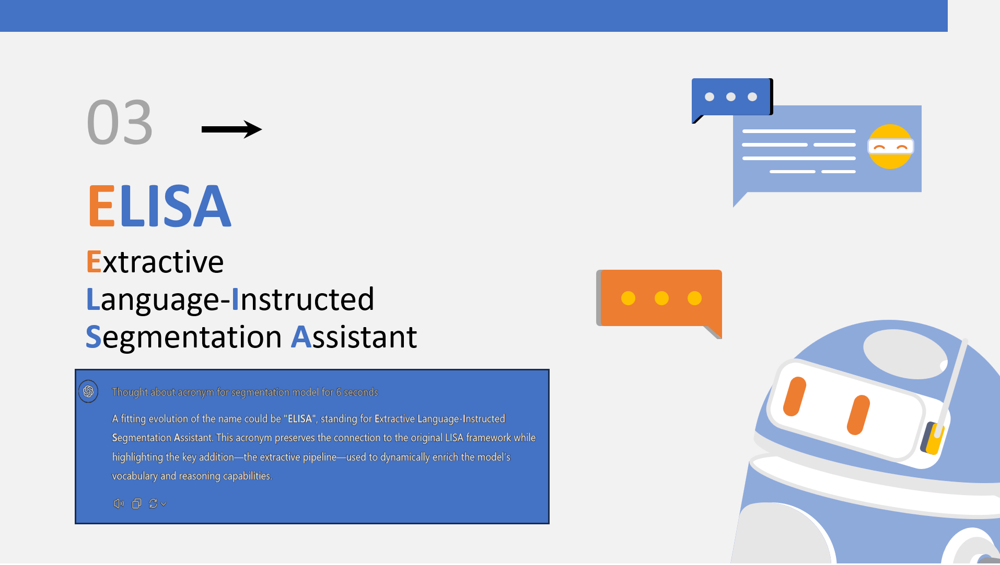

# ELISA: Extractive Language-Instructed Segmentation Assistant

An improved implementation building upon [LISA](https://github.com/dvlab-research/LISA) (Language-Instructed Segmentation Assistant).

Click to download presentation

## References
This work builds upon the original LISA implementation and research:
- LISA: Reasoning Segmentation via Large Language Model (Lai et al., 2023)
- An Improved Baseline for Reasoning Segmentation with Large Language Model (Yang et al., 2023)
- Original LISA repository: https://github.com/dvlab-research/LISA

